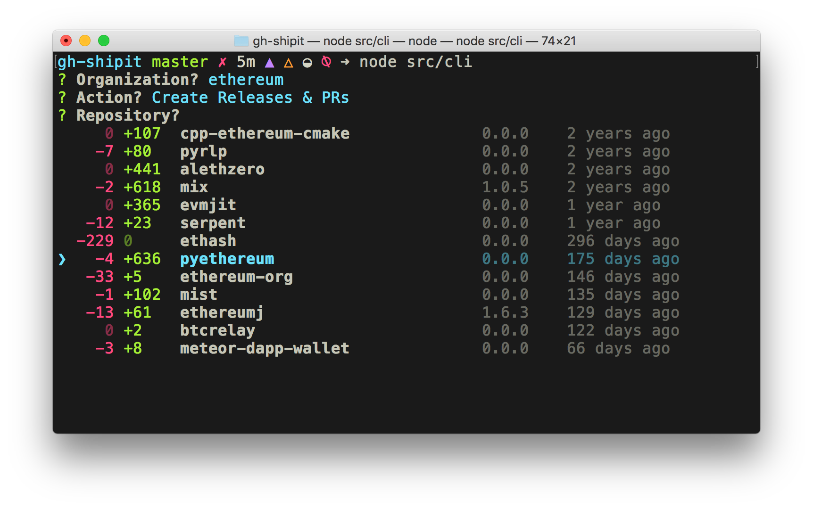
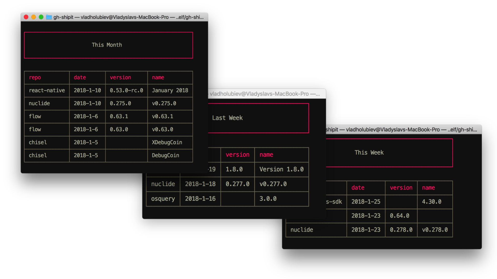
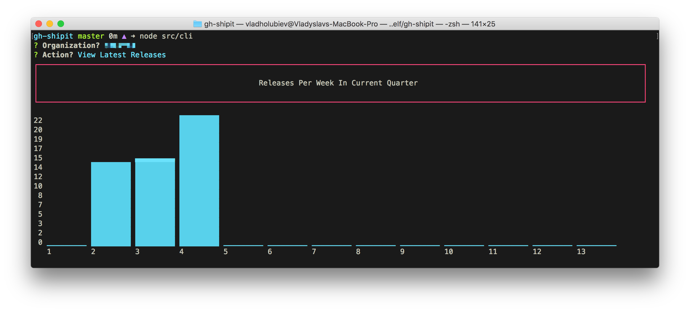

<p align="left"></p>

[](https://circleci.com/gh/vladgolubev/gh-shipit)




## Install

```
$ npx gh-shipit
```

`node` >=12 required. [still don't know about npx?](https://medium.com/@maybekatz/introducing-npx-an-npm-package-runner-55f7d4bd282b)

## Features

### Prepare Release

- Detailed overview of all the repos in organization
  - View how many commits in `develop` are ahead of `master`
  - View how many commits in `master` are behind of `develop`
  - View latest commit date in `develop`
  - View latest version released
  - View latest release draft version
- Create a release branch in git-flow style (`release/vX.x.x`)
- Open branch comparison on github in browser to decide on release name
- Create a PR from release branch to `master`
- Create Release Notes Draft
- Create `release` label in repo and assign it to PR
- Open created PR in browser

### Merge [Renovate bot](https://renovate.whitesourcesoftware.com/) PRs in bulk

- Fuzzy search with autocomplete
- Approve & merge PRs in parallel, 10 merges concurrently
- Print number of merged PRs and URLs to PRs failed to merge

### View Latest Releases

- Histogram of releases per week in current quarter
- Releases this week
- Releases last week
- Releases this month
- Releases this quarter

### Screenshots





## Usage

Follow interactive instructions

```bash
$ shipit
```

## License

MIT © [Vlad Holubiev](http://vladholubiev.com)
